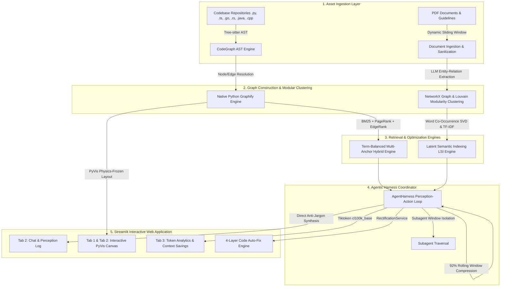

# Graph-Based LLM Context Optimization Engine 🚀

An enterprise-grade, local-first **Graph-RAG & Agentic Harness Framework** designed to optimize Large Language Model (LLM) context windows for both **Structured Codebases** and **Unstructured Documents (PDFs/Guidelines)**.

By transforming raw repositories into multi-lingual Abstract Syntax Trees (CodeGraph/Graphify) and unstructured text into Louvain Community Graphs (LangGraph), this system achieves up to **95% Net Context Reduction**, eliminates **HTTP 429 Rate Limit Exceeded** errors, and lowers API costs.

---

## 🌟 Key Features & Architectural Capabilities

### 1. 🌲 Multi-Lingual CodeGraph (Tree-sitter AST Parser)
* **8 Languages Supported Out-of-the-Box**: Python, JavaScript, TypeScript, Go, Rust, Java, C, and C++.
* **Deterministic AST Extraction**: Slices code at exact byte boundaries (`start_byte`, `end_byte`, `line_start`, `line_end`) using Tree-sitter grammars.
* **Symbol Index & Call Resolution**: Cross-file symbol resolution links function invocations (`calls`), inheritance (`extends`), and dependencies (`imports`) across modules.
* **Built-in Noise Filtering**: Filters out 50+ language built-ins (`print`, `len`, `dict`, `open`, `map`) to prevent graph star-topology clutter.

### 2. ⚡ Native Python Graphify Engine
* **Macro-Level Pruning**: Filters out micro-level functions/methods, pruning 2,000+ AST nodes down to 50–100 macro architectural components (**Files, Classes, Components**).
* **Relationship Lifting**: Automatically lifts micro function-call edges up to parent container relationships (`File_A --[depends_on]--> File_B`).
* **Zero CLI Subprocess Dependency**: Operates 100% natively in Python memory—zero external binary execution, zero path errors on Cloud/Linux/Windows.

### 3. 🧩 Unstructured Document LangGraph (Louvain Community Detection)
* **Dynamic Sliding-Window Chunking**: Dynamically scales chunk size and overlap based on document length (~7 chunks target, bounded between 1,000 and 15,000 characters) with **Sentence & Word Boundary Snapping**.
* **Fuzzy Canonical Entity Deduplication**: Uses `thefuzz.fuzz.token_set_ratio` (\(\ge 90\)) to merge duplicate entity nodes across chunks and pages (e.g. `andrew_ng` and `prof_andrew_ng`).
* **Louvain Modularity Maximization**: Clusters nodes into dense, topical communities using graph modularity optimization with **Dynamic Resolution Scaling** (\(\gamma \ge 1.0\)).

### 4. 🔬 Latent Semantic Indexing (LSI / SVD Retrieval)
* **Word Co-Occurrence SVD Factorization**: Builds a term-by-term co-occurrence matrix \(C \in \mathbb{R}^{V \times V}\) and computes low-rank SVD decomposition (\(C = U \Sigma V^T\)) to discover latent topic associations.
* **Adaptive Cumulative Variance (Elbow Method)**: Dynamically selects SVD rank \(k\) by calculating the 90% cumulative explained variance threshold (\(\sum \sigma_i^2 / \sum \sigma^2 \ge 0.90\)) for medium/large corpora.
* **General Stopword Filter & TF-IDF Weighting**: Strips English grammatical function words and applies TF-IDF weights to composite document/query vectors.
* **2-Hop Ego Subgraph Anchoring**: Extracts localized 2-hop neighborhood subgraphs (\(r=2\)) around query anchor nodes to maximize signal-to-noise ratio.

### 5. 🤖 Agentic Harness (Master Perception-Action Loop)
* **Stateless Perception-Action Engine**: Runs a ReAct `while` loop that coordinate cross-graph queries between the Codebase CodeGraph and PDF LangGraph.
* **92% Rolling Window Context Compression Engine**: Monitors history size and automatically condenses older turns whenever context reaches 92% capacity (11,040 chars), keeping recent observations crisp.
* **Optional Plan Bypassing**: Skips `todo_write` for direct 1-step queries to save 1 full API call per query.
* **Subagent Context Window Isolation (`spawn_subagent`)**: Delegates massive graph traversals to isolated sub-context windows, returning 2-bullet point summaries to the main planner.
* **Direct Anti-Jargon Synthesis Guidelines**: Enforces clean, concise, senior software architect answers without filler or self-referential technical jargon.

### 6. 🛠️ 4-Layer Resilient Code Rectification Engine
* **Automated Code Repair**: Applies proposed code fixes directly to disk files with 4 fallback layers:
  * *Layer A*: Exact match substitution.
  * *Layer B*: Line-by-line normalized window matching.
  * *Layer C*: Dynamic Indentation Delta Adjustment (\(\Delta_{\text{indent}}\)) for Python space alignment.
  * *Layer D*: Jupyter Notebook (`.ipynb`) JSON cell source patching.
* **Safety Backups (`.bak`)**: Automatically creates `.bak` safety backups before disk modification.
* **Real-time Pipeline Rebuilding**: Triggers instant CodeGraph and Graphify graph rebuilding upon fix application.

### 7. 📊 Interactive PyVis Visualization & Token Analytics
* **Physics-Stabilized PyVis Rendering**: Pre-computes Kamada-Kawai and Fruchterman-Reingold Spring layouts in Python, scaling coordinates to PyVis canvas so nodes **never dance or vibrate**.
* **Multi-Turn Token Analytics**: Uses `tiktoken` (`cl100k_base`) to measure pure **Derived Graph Context Tokens** vs. **Raw Asset Baseline Contexts**, displaying real-time reduction metrics and interactive cumulative bar charts.

---

## 🏛️ System Architecture



---

## 📐 Mathematical Foundations

### 1. Dynamic Chunk Size Calculation
\[C = \min\left(15000, \; \max\left(1000, \; \lfloor \frac{L}{7} \rfloor\right)\right), \quad O = \lfloor \frac{C}{10} \rfloor, \quad S = C - O\]

### 2. Louvain Community Modularity (\(Q\))
\[Q = \frac{1}{2m} \sum_{i,j} \left[ A_{ij} - \gamma \frac{k_i k_j}{2m} \right] \delta(c_i, c_j)\]

### 3. Word Co-Occurrence SVD & Latent Semantic Factorization
\[C = U \Sigma V^T, \quad W = U_k \Sigma_k \in \mathbb{R}^{V \times k}\]
\[\text{Cumulative Explained Variance Ratio}(k) = \frac{\sum_{i=1}^k \sigma_i^2}{\sum_{i=1}^V \sigma_i^2} \ge 0.90\]

### 4. BM25 Lexical Keyword Ranking
\[S_{\text{BM25}}(v, q) = \sum_{i=1}^m \text{IDF}(q_i) \cdot \frac{f(q_i, v) \cdot (k_1 + 1)}{f(q_i, v) + k_1 \cdot \left(1 - b + b \cdot \frac{|v|}{\text{avgdl}}\right)}\]

### 5. Code Rectification Indentation Delta Alignment
\[\Delta_{\text{indent}} = |I_{\text{file}}| - |I_{\text{proposed}}|\]
\[L' = \text{Spaces}(\Delta_{\text{indent}}) + L \quad (\text{if } \Delta_{\text{indent}} > 0)\]

---

## ⚡ Fast Start Guide

### 1. Prerequisites
* Python 3.10+ installed.
* An API key for **Google Gemini** or **Groq**.

### 2. Quick Setup & Run

```powershell
# 1. Clone the repository
git clone https://github.com/Bibek4797/Context-Optimization.git
cd Context-Optimization

# 2. Create and activate a virtual environment
python -m venv .venv
.\.venv\Scripts\Activate.ps1   # On Windows
# source .venv/bin/activate    # On Linux/macOS

# 3. Install dependencies
pip install -r requirements.txt

# 4. Launch the Streamlit application
streamlit run streamlit_app.py
```

### 3. Streamlit Community Cloud Deployment
1. Push this repository to GitHub.
2. Create a new Streamlit app connected to your repository.
3. Set the main entrypoint file to `streamlit_app.py`.
4. Configure App Secrets (`.streamlit/secrets.toml`):
   ```toml
   GEMINI_API_KEY = "your_gemini_api_key_here"
   GROQ_API_KEY = "your_groq_api_key_here"
   ```

---

## 📂 Repository Structure

```text
c:\Users\BIBEK\OneDrive\Desktop\context_optimization_project\
├── backend/app/
│   ├── core/                  # App configuration & singleton wiring
│   ├── models/                # Pydantic schemas for graph nodes, edges, queries
│   └── services/
│       ├── agent_harness.py   # Central Agentic Harness perception-action loop
│       ├── chat_service.py    # CodeGraph QA orchestration & prompt builder
│       ├── codegraph_service.py# Tree-sitter AST parsing & symbol indexer
│       ├── graphify_service.py# Native Python macro pruning & edge lifting
│       ├── graph_retrieval_service.py # BM25 + PageRank + EdgeRank hybrid retrieval
│       ├── rectification_service.py  # 4-layer code patching & .ipynb fixer
│       ├── token_service.py   # Tiktoken BPE context estimation & analytics
│       ├── tree_sitter_service.py    # Multi-lingual Tree-sitter parser wrapper
│       └── unstructured/
│           ├── communities.py # Louvain modularity clustering
│           ├── documents.py   # PDF/text ingestion & dynamic sliding-window chunking
│           ├── graph_builder.py# LLM entity-relation extraction & fuzzy deduplication
│           ├── llm_client.py  # Unified LLM provider client wrapper
│           ├── retrieval.py   # Word co-occurrence SVD & LSI retrieval
│           └── visualization.py# PyVis canvas layout pre-computation & styling
├── streamlit_app.py           # Multi-tab Streamlit user interface
├── requirements.txt           # Python dependency manifest
└── README.md                  # System architecture documentation
```

---

## 📜 License
Distributed under the MIT License. See `LICENSE` for more information.
